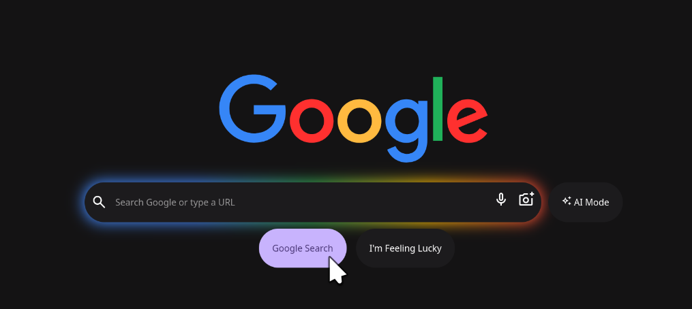

# Google Material You Redesign 🎨

A modern, responsive redesign of the Google homepage inspired by **Material You (Material Design 3)** aesthetics.

This project was built from scratch using pure **HTML & CSS** as a **one-day speed coding challenge** to refresh frontend fundamentals.

## ✨ Features

- **Material You Aesthetics:** Dark mode with pastel accents and rounded UI elements.
- **Glowing Search Bar:** Custom CSS glow effect using pseudo-elements.
- **Fully Responsive:** Adapts seamlessly to mobile and desktop screens.
- **No Frameworks:** Built with 100% vanilla CSS (Flexbox & CSS Variables).

## 🚀 Live Demo

Check out the live version here:
[**View Project**](https://al-jbri.github.io/google-material-you/)
