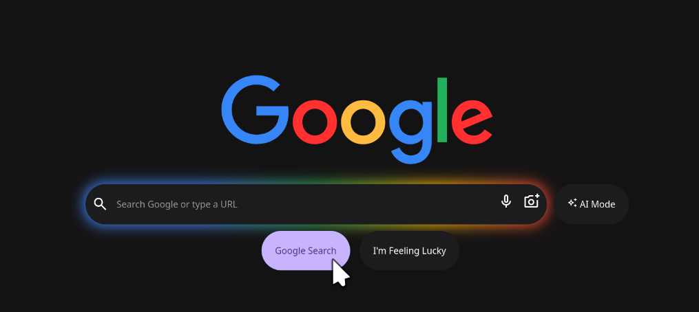

# Google Material You Redesign (Archived)

> **Note:** This project has been archived. It was a hands-on practice project built during my early learning journey to master CSS fundamentals and web UI layouts. It is no longer under active development.

## About the Project
A simple Google Material You Redesign to the material you design language, The primary goals of this learning project were to practice:
* Using `Flexbox` and make a responsive pages.
* a challenge for me to Building the project in one day (almost).

##  Preview


## How to run?
You can clone the repo using:
```bash
git clone https://github.com/al-jbri/google-material-you
```
and run the `index.html` file

thanks :)
